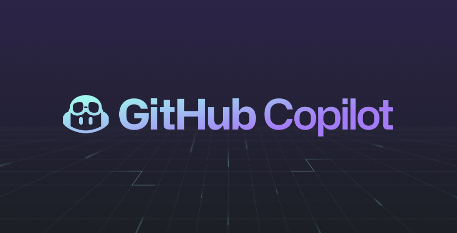

# Github_Copilot_APIs

## Goal of the Repository

The goal of this repository is to present and demonstrate the capabilities of GitHub Copilot, an AI-powered code completion tool. GitHub Copilot helps developers by suggesting code snippets, functions, and even entire classes based on the context of the code being written.

## Features

- Code completion
- Function and class suggestions
- Context-aware code snippets
- Support for multiple programming languages

## Getting Started

To get started with GitHub Copilot, follow these steps:

1. Install the GitHub Copilot extension in your IDE (e.g., Visual Studio Code).
2. Open a project or create a new one.
3. Start writing code and observe the suggestions provided by GitHub Copilot.

## Usage

GitHub Copilot can be used in various scenarios, such as:

- Writing new code
- Refactoring existing code
- Learning new programming languages or frameworks
- Exploring different coding approaches

## Contributing

Contributions to this repository are welcome. Feel free to open issues or submit pull requests to improve the examples and documentation.

## Documentation

For more detailed documentation, please visit our [Wiki](https://github.com/DevSophs/Github_Copilot_APIs/wiki).

## About the APIs team for GenAI-HUB in EY

- Caringella Roberta
- Ierardi Filippo Giovanni
- Pierini Sofia 

## License

This project is licensed under the MIT License. See the [LICENSE](LICENSE) file for details.

## Disclaimer

This README has been created with Copilot. The author has never been able to write a decent README.